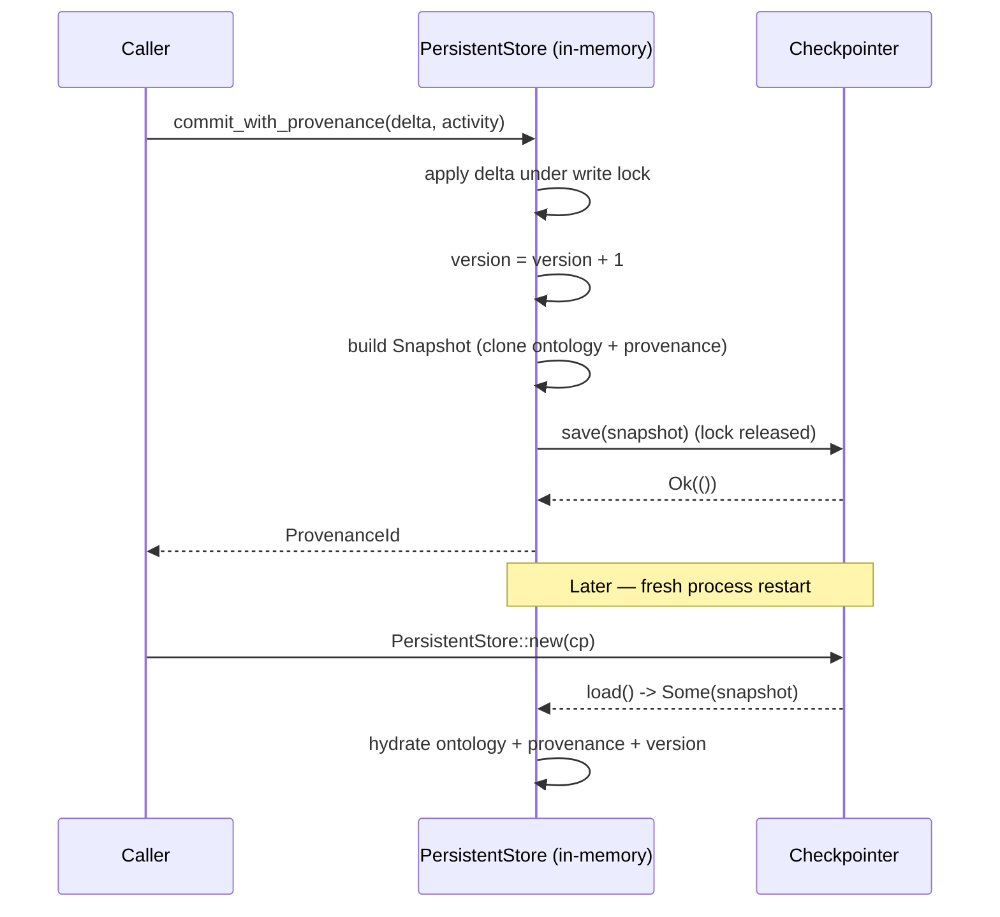

# Persistence

`atomr-ontology-persist` plugs durable storage in behind the
`OntologyStore` trait. The crate defines a single-method
`Checkpointer` provider trait and a `PersistentStore` wrapper that
buffers writes in memory and flushes a `Snapshot` to the provider on
every commit. Three providers ship in-tree: an in-memory one for
tests, a JSON-file one for single-process workflows, and a SQLite one
for append-only history. New providers (Postgres, S3, …) are a
trait-impl away.

## When to reach for this

- You want commit-grained durability without writing a custom
  `OntologyStore` impl.
- You need to round-trip an `Ontology` + `ProvenanceLog` through JSON
  for inter-process handoff or debugging.
- You are layering `atomr-ontology-version` on top and want each
  branch tip to survive a process restart — pair `PersistentStore`
  with `FileCheckpointer` or `SqliteCheckpointer`.
- You want a known shape for tests: `MemCheckpointer` is a
  drop-in stand-in for any real provider.

## Concepts

The wrapper exposes the same `OntologyStore` surface as `MemStore`:
reads return from the in-memory copy, writes mutate in memory, and
`commit_with_provenance` is the only operation that touches the
provider.

| Type | Role |
| --- | --- |
| `Checkpointer` | Provider trait — `async save`, `async load`, `label` |
| `Snapshot` | `{ ontology, provenance, version: u64 }` — the unit of persistence |
| `MemCheckpointer` | `Arc<Mutex<Option<Snapshot>>>` — tests / ephemeral |
| `FileCheckpointer` | JSON-on-disk (feature `file`) |
| `SqliteCheckpointer` | Append-only `snapshots(id, json, version)` (feature `sqlite`) |
| `PersistentStore<C>` | `OntologyStore` impl over any `C: Checkpointer` |
| `CheckpointerError` | `Io` / `Serialize` / `Other` — folded into `StoreError::Io` |

`Snapshot` serializes through a private wire form (see
[`wire.rs`](../crates/atomr-ontology-persist/src/wire.rs)) that
flattens the `BTreeMap<Id, _>` ledgers to vectors and hex-encodes the
32-byte newtype ids so JSON round-trips cleanly.

## Commit / save / reload



The write lock is released **before** awaiting `save`, so the
provider's I/O does not block concurrent readers.

## Rust example

```rust
use atomr_ontology_persist::{FileCheckpointer, PersistentStore};
use atomr_ontology_provenance::Activity;
use atomr_ontology_store::r#trait::{OntologyDelta, OntologyStore};
use atomr_ontology_testkit::toy_org_ontology;
use tempfile::tempdir;

#[tokio::main]
async fn main() -> Result<(), Box<dyn std::error::Error>> {
    let dir = tempdir()?;
    let cp = FileCheckpointer::new(dir.path().join("ontology.json"));
    let store = PersistentStore::new(cp).await?;

    // Seed the store with the toy_org_ontology fixture by replaying its
    // nodes and edges through a single commit.
    let seed = toy_org_ontology();
    let mut delta = OntologyDelta::new();
    for node in seed.nodes.into_values() { delta = delta.with_node(node); }
    for edge in seed.edges.into_values() { delta = delta.with_edge(edge); }
    let pid = store
        .commit_with_provenance(delta, Activity::started("seed"))
        .await?;
    assert_eq!(store.version(), 1);

    // Re-open against the same file — state hydrates from the snapshot.
    let cp2 = FileCheckpointer::new(dir.path().join("ontology.json"));
    let store2 = PersistentStore::new(cp2).await?;
    assert_eq!(store2.version(), 1);
    assert!(store2.provenance().await?.activities.contains_key(&pid));
    Ok(())
}
```

## Python example

```python
import asyncio, tempfile, os
from atomr_ontology.persist import FileCheckpointer, PersistentStore
from atomr_ontology.testkit import toy_org_ontology

async def main() -> None:
    with tempfile.TemporaryDirectory() as d:
        path = os.path.join(d, "ontology.json")

        cp = FileCheckpointer(path)
        store = await PersistentStore.from_file(cp)
        # The Python surface currently exposes construction + version();
        # writes go through the lower-level store APIs in atomr_ontology.store.
        assert store.version() == 0

        # Re-opening against the same file rehydrates from the snapshot
        # written by any prior process.
        cp2 = FileCheckpointer(path)
        store2 = await PersistentStore.from_file(cp2)
        assert store2.version() >= 0

        # The fixture is available for ergonomic seeding from tests.
        seed = toy_org_ontology()
        assert len(seed.nodes) == 3

asyncio.run(main())
```

## Key types and source paths

| Type | File |
| --- | --- |
| `Checkpointer`, `Snapshot`, `CheckpointerError`, `MemCheckpointer` | `crates/atomr-ontology-persist/src/checkpointer.rs` |
| `PersistentStore<C>` | `crates/atomr-ontology-persist/src/store.rs` |
| `FileCheckpointer` (feature `file`) | `crates/atomr-ontology-persist/src/file.rs` |
| `SqliteCheckpointer` (feature `sqlite`) | `crates/atomr-ontology-persist/src/sqlite.rs` |
| Wire format adapter | `crates/atomr-ontology-persist/src/wire.rs` |
| Python bindings (`MemCheckpointer`, `FileCheckpointer`, `PersistentStore`) | `crates/atomr-ontology-py/src/persist.rs` |
| Python stubs | `crates/atomr-ontology-py/python/atomr_ontology/persist.pyi` |

## Cross-links

- [`architecture.md`](architecture.md) — where persistence sits in
  the tier stack and how it talks to Tier 2 store consumers.
- [`data-model.md`](data-model.md) — `Ontology`, `ProvenanceLog`,
  and id types that make up a `Snapshot`.
- [`versioning.md`](versioning.md) — pairing branchable history with
  a `FileCheckpointer` for durable, time-travelable storage.
