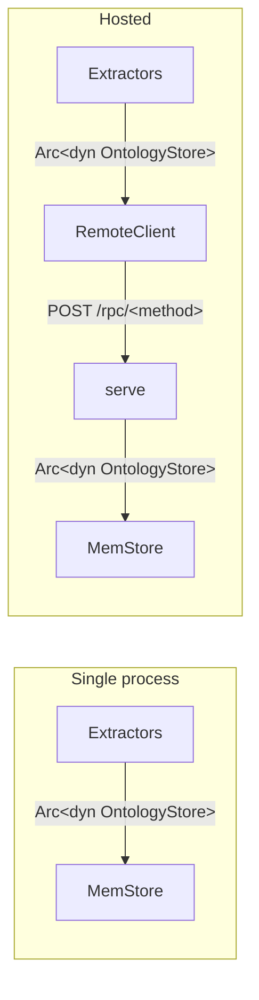

# Remote store

## Purpose

`atomr-ontology-remote` exposes `OntologyStore` over HTTP/JSON. The
`server` feature wraps any local store (typically `MemStore`) in a
small hand-rolled HTTP/1.1 listener; the `client` feature gives you a
`RemoteClient` that implements the same `OntologyStore` trait by
issuing POSTs. Local single-process callers and remote callers share
exactly one trait surface — `Arc<dyn OntologyStore>` — and the wire
boundary is transparent at the call site.

## When to reach for this

- You want to share one ontology across multiple processes or
  machines (a long-running indexer, a query service, an extraction
  worker pool).
- You want to plug a non-Rust client into the same store the Rust
  extractors are writing into.
- You need to colocate the store with persistent storage and keep the
  extractors stateless.

For everything else — embedded extraction, single-process pipelines,
tests — call `MemStore` directly and skip this crate.

## Topology



The trait boundary is identical on both sides. Code that took
`Arc<dyn OntologyStore>` keeps working when you swap in
`Arc::new(RemoteClient::new(url)?)`.

## Protocol

- Transport: JSON over HTTP/1.1, one request per connection
  (`Connection: close`).
- Route: `POST <base_url>/rpc/<method>` with
  `Content-Type: application/json`.
- Body: an `RpcEnvelope { method, params }` whose `params` field is
  one of the per-method request structs in
  `atomr_ontology_remote::protocol`.
- Response: `RpcResponse { result?, error? }` — exactly one of the
  two fields is populated. Non-2xx HTTP statuses also carry a
  best-effort `RpcResponse` body so the client can surface the
  server's error message via `RemoteError::Server`.

| Method constant | `OntologyStore` method |
| --- | --- |
| `method::UPSERT_NODE` | `upsert_node` |
| `method::UPSERT_EDGE` | `upsert_edge` |
| `method::UPSERT_AXIOM` | `upsert_axiom` |
| `method::GET_NODE` | `node` |
| `method::GET_EDGE` | `edge` |
| `method::MATCH_PATTERN` | `match_pattern` |
| `method::TRAVERSE` | `traverse` |
| `method::SNAPSHOT` | `snapshot` |
| `method::DIFF` | `diff` |
| `method::COMMIT` | `commit_with_provenance` |
| `method::PROVENANCE` | `provenance` |

`RemoteError` collapses the three failure modes the boundary can hit:
`Transport(String)` for socket/HTTP I/O, `Server(String)` for
server-side errors, and `Encoding(String)` for JSON serialize/parse
failures. On the client trait surface these are flattened into
`StoreError::Io`.

## Wire types

JSON map keys must be strings, but several `atomr-ontology-store` and
`atomr-ontology-core` types either don't derive `serde` or rely on
`BTreeMap<NodeId, _>` where `NodeId` serializes as a 32-byte array.
The `protocol` module mirrors those types with `Wire*` structs and
`From` conversions in both directions:

| In-process | Wire type | Why |
| --- | --- | --- |
| `NodePattern`, `EdgePattern`, `TraversalPlan`, `TraversalStep`, `MatchRow`, `StoreDiff`, `OntologyDelta` | `WireNodePattern`, ..., `WireOntologyDelta` | These types do not derive `serde::{Serialize, Deserialize}` — the trait surface stays serde-free. |
| `Ontology` | `WireOntology` | `BTreeMap<NodeId, Node>` can't be a JSON object (keys aren't strings). The wire form flattens to `Vec<Node>`; the id is already inside `Node`, so the round-trip is lossless. |
| `ProvenanceLog` | `WireProvenanceLog` | Same reason — flattens `activities` / `entities` to `Vec`s. |
| `SortOrder` | `WireSortOrder` | Local enum is not `Serialize`; wire form serializes as `"ascending"` / `"descending"`. |
| `RangeInclusive<usize>` on `EdgePattern::repeat` | `[usize; 2]` | `RangeInclusive` does not serialize stably; we send `[min, max]`. |

## Rust example

```rust
use std::net::SocketAddr;
use std::sync::Arc;

use atomr_ontology_core::Node;
use atomr_ontology_store::{MemStore, NodePattern, OntologyStore};
use atomr_ontology_remote::{serve, RemoteClient};

#[tokio::main]
async fn main() -> Result<(), Box<dyn std::error::Error>> {
    // 1. Stand up a store and declare a type.
    let backing = Arc::new(MemStore::new());
    backing.with_mut(|o| o.declare_node_type("Organization"));

    // 2. Bind a server on an ephemeral port.
    let addr: SocketAddr = "127.0.0.1:0".parse()?;
    let store: Arc<dyn OntologyStore> = backing.clone();
    let handle = serve(addr, store).await?;

    // 3. Build a client against the bound address.
    let url = format!("http://{}", handle.local_addr());
    let client = RemoteClient::new(url)?;

    // 4. Drive the store over HTTP.
    let acme = Node::new("Organization").with_property("name", "Acme");
    let id = client.upsert_node(acme).await?;
    let fetched = client.node(&id).await?.expect("just inserted");
    assert!(fetched.has_type("Organization"));

    let rows = client
        .match_pattern(&NodePattern::any().bind("o").typed("Organization"))
        .await?;
    assert_eq!(rows.len(), 1);

    // 5. Clean shutdown.
    handle.shutdown().await?;
    Ok(())
}
```

## Python example

```python
import asyncio

from atomr_ontology.remote import RemoteClient


async def main() -> None:
    # Assumes a server is already running (e.g. started from Rust
    # via `serve`, or via a separate atomr-ontology-server binary).
    client = RemoteClient("http://127.0.0.1:8080")
    print(client.base_url)
    # Full async parity (upsert_node, match_pattern, etc.) lands as
    # users adopt the remote store in Python; the type stub in
    # `atomr_ontology/remote.pyi` tracks the current surface.


asyncio.run(main())
```

## Random-port test pattern

`ServerHandle::local_addr()` lets integration tests bind port `0` and
read back the kernel-assigned port. The pattern in
`crates/atomr-ontology-remote/tests/integration.rs` is the canonical
example: build a `MemStore`, bind `127.0.0.1:0`, point a
`RemoteClient` at `format!("http://{}", handle.local_addr())`,
exercise the trait, then `handle.shutdown().await`. Dropping the
handle without `shutdown` also stops the listener — the `Drop` impl
signals the shutdown channel and aborts the task — but `shutdown` is
preferable when you want to await the listener exit deterministically.

## Feature flags

| Feature | Pulls in | Use when |
| --- | --- | --- |
| `client` *(default)* | `reqwest`, `tokio` | You want `RemoteClient`. |
| `server` *(default)* | `tokio` | You want `serve` + `ServerHandle`. |
| `default` | `client`, `server` | Single binary that hosts and consumes the store (tests, dev). |

Disable defaults and pick exactly one to slim transitive deps in
production: a query-only worker takes `--no-default-features --features client`;
a host process exposing the store to others takes
`--no-default-features --features server`.

## Reference

| Path | Contents |
| --- | --- |
| `crates/atomr-ontology-remote/src/lib.rs` | Crate root, feature gating, public re-exports. |
| `crates/atomr-ontology-remote/src/protocol.rs` | `RpcEnvelope`, `RpcResponse`, `RemoteError`, method-name constants, request/response payloads, all `Wire*` mirrors. |
| `crates/atomr-ontology-remote/src/client.rs` | `RemoteClient` + its `OntologyStore` impl. |
| `crates/atomr-ontology-remote/src/server.rs` | `serve`, `ServerHandle`, the hand-rolled HTTP/1.1 dispatcher. |
| `crates/atomr-ontology-remote/tests/integration.rs` | End-to-end smoke test: random port + full trait round-trip. |
| `crates/atomr-ontology-py/src/remote.rs` | PyO3 `RemoteClient` wrapper. |
| `crates/atomr-ontology-py/python/atomr_ontology/remote.pyi` | Python type stubs. |

## Cross-links

- [`architecture.md`](architecture.md) — where the remote boundary
  sits relative to Tier 2 (`atomr-ontology-store`).
- [`data-model.md`](data-model.md) — definitions of the
  `Node` / `Edge` / `Axiom` / `Ontology` shapes that travel over the
  wire.
