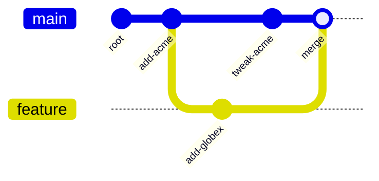

# Versioning

`atomr-ontology-version` puts Git-style history over `Ontology`
snapshots. Each commit owns a full snapshot; commit ids are
content-addressed Blake3 digests over `(parent, message, snapshot)`,
so reproducible pipelines produce reproducible histories. Branches
are named pointers into the commit DAG, merges are 3-way operations
parameterized by a strategy, and `as_of` returns the snapshot at any
past commit.

## When to reach for this

- You want to fork the live ontology, experiment, and merge back
  without mutating the canonical state.
- You need deterministic, reproducible commit ids — two pipelines
  that produce the same snapshot must agree on the same id.
- You want to compare "the ontology now" against "the ontology at
  commit X" without keeping deltas yourself.
- You are persisting a `VersionedStore` to a `FileCheckpointer` so
  the commit DAG survives across processes.

## Concepts

`VersionedStore` is intentionally in-memory: persistence layers on
top by serializing `commits` + `branches` (the struct derives
`Serialize`/`Deserialize`). Time-travel reads return a borrow of the
in-place snapshot rather than reconstructing from deltas.

| Type | Role |
| --- | --- |
| `CommitId` | 32-byte Blake3 digest; lowercase hex `Display` / `FromStr` |
| `Commit` | `{ id, parent, second_parent, message, author, timestamp, snapshot, activity }` |
| `MergeStrategy` | `Ours` / `Theirs` / `Union` — see below |
| `Branch`, `BranchRef`, `BranchRegistry` | Value types for named heads |
| `VersionedStore` | `{ commits: BTreeMap, branches: HashMap, current: String }` |
| `VersionError` | `UnknownBranch`, `UnknownCommit`, `BranchExists`, `SelfMerge`, … |
| `DEFAULT_BRANCH` | `"main"` — what `init()` selects |

Commit id construction mixes (parent, message, snapshot) only. The
author, timestamp, and merge `second_parent` are recorded on the
commit but **not** in the id, so two runs with the same input produce
the same id regardless of who or when. Merge commits feed
`second_parent` into the id via a synthetic message extension so
distinct merges aren't collapsed.

### Merge strategies

| Strategy | Semantics |
| --- | --- |
| `Ours` | Keep the current branch's snapshot verbatim; discard the other side. The merge commit still records both parents. |
| `Theirs` | Adopt the other branch's snapshot verbatim; current side is discarded. |
| `Union` | Per-key union of `nodes`, `edges`, `axioms`, `schema.node_types`, `schema.edge_types`. On collision, **ours wins** (per-key, not per-snapshot). Vocabulary and `iri` are not set-merged — ours is kept. |

`Union` is the closest analogue to a non-conflicting Git merge:
additions from both sides survive; collisions resolve toward the
current branch.

## Commit DAG



`log()` from the merge commit walks both parents breadth-first, so
every commit reachable from the current head appears exactly once.

## Interplay with `PersistentStore`

`VersionedStore` is `Serialize`/`Deserialize` end-to-end. To get
durable history, persist the whole store on each commit. The
straightforward pattern is to serialize the `VersionedStore` to JSON
and route it through `atomr-ontology-persist`'s `FileCheckpointer`
or `SqliteCheckpointer` — each commit + flush makes the branch tips
and the full DAG recoverable on restart. See
[`persistence.md`](persistence.md) for the `Checkpointer` contract.

## Rust example

```rust
use atomr_ontology_version::{MergeStrategy, VersionedStore};
use atomr_ontology_testkit::toy_org_ontology;
use atomr_ontology_core::{Iri, Node, Ontology};

fn main() -> Result<(), Box<dyn std::error::Error>> {
    let mut store = VersionedStore::init();
    let root = store.commit("seed".into(), "alice".into(), toy_org_ontology());
    assert_eq!(store.current_branch(), "main");

    // Fork "feature" off main and diverge.
    store.branch("feature".into())?;
    store.checkout("feature")?;
    let mut feat = toy_org_ontology();
    feat.declare_node_type("Project");
    feat.upsert_node(Node::from_iri(
        Iri::new("https://example.org/Atomr")?, "Project",
    ));
    let _feat_tip = store.commit("add-project".into(), "bob".into(), feat);

    // Merge back into main with Union — both sides' additions survive.
    store.checkout("main")?;
    let merge_id = store.merge("feature", MergeStrategy::Union)?;

    let merged = store.commit_at(merge_id).expect("merge commit");
    assert!(merged.second_parent.is_some());
    assert!(store.as_of(root).is_some(), "root snapshot is still reachable");
    Ok(())
}
```

## Python example

```python
from atomr_ontology.version import MergeStrategy, VersionedStore
from atomr_ontology.testkit import toy_org_ontology
from atomr_ontology.core import Iri, Node, Ontology

store = VersionedStore()
root = store.commit("seed", "alice", toy_org_ontology())
assert store.current() == "main"

# Fork off main and diverge.
store.branch("feature")
store.checkout("feature")
feat = toy_org_ontology()
feat.declare_node_type("Project")
feat.upsert_node(Node.from_iri(Iri("https://example.org/Atomr"), "Project"))
store.commit("add-project", "bob", feat)

# Merge back into main using Union strategy.
store.checkout("main")
merge_id = store.merge("feature", MergeStrategy.Union)

# as_of(root) re-borrows the original snapshot.
historical = store.as_of(root)
assert historical is not None
assert "feature" in store.branches()
```

## Key types and source paths

| Type | File |
| --- | --- |
| `CommitId`, `Commit`, `MergeStrategy`, `compute_id` | `crates/atomr-ontology-version/src/commit.rs` |
| `Branch`, `BranchRef`, `BranchRegistry` | `crates/atomr-ontology-version/src/branch.rs` |
| `VersionedStore`, `VersionError`, `DEFAULT_BRANCH` | `crates/atomr-ontology-version/src/store.rs` |
| Python bindings (`CommitId`, `MergeStrategy`, `VersionedStore`) | `crates/atomr-ontology-py/src/version.rs` |
| Python stubs | `crates/atomr-ontology-py/python/atomr_ontology/version.pyi` |

## Cross-links

- [`architecture.md`](architecture.md) — where versioning sits in
  the tier stack relative to the in-memory store and persistence.
- [`data-model.md`](data-model.md) — what's inside a `Commit.snapshot`
  (nodes, edges, axioms, schema, vocabulary).
- [`persistence.md`](persistence.md) — pair `VersionedStore` with a
  `FileCheckpointer` or `SqliteCheckpointer` to make the DAG durable
  across processes.
